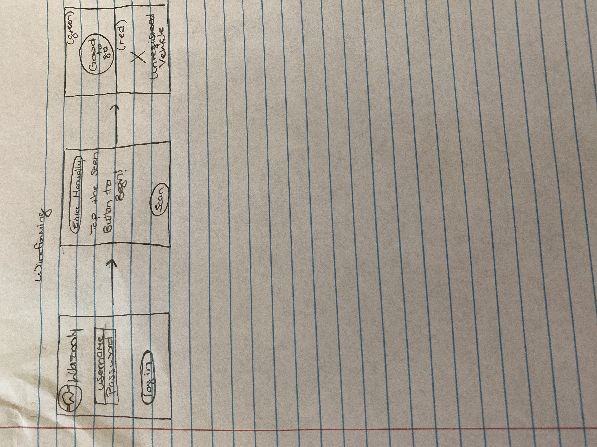
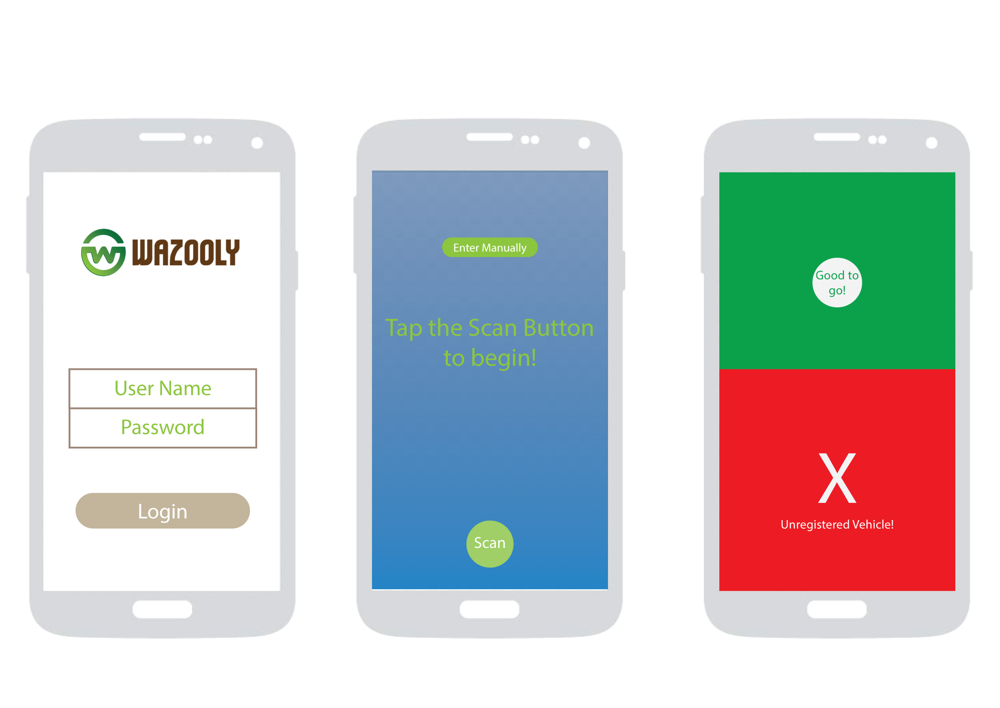

Group Project - README Template
===

# Wazooly

## Table of Contents
1. [Overview](#Overview)
1. [Product Spec](#Product-Spec)
1. [Wireframes](#Wireframes)
2. [Schema](#Schema)

## Overview
### Description
Wazooly is a mobile application that will track when a child's guardian is there to pick them up.

### App Evaluation
[Evaluation of your app across the following attributes]
- **Category:** Artificial Intelligence
- **Mobile:** This mobile application will use Computer Vision and Natural Language Processing to track when a guardian is at the location to pick up their child(ren).
- **Story:** Captures a picture of the vehicle license plate and logs in the vehicle as present to pick up the child associated with the vehicle license plate.
- **Market:** This application is for schools for that want to simplify their guardian - child pickup routine.
- **Habit:** This app could be used as often or unoften as the user wanted depending on how much the school wants to use the app.
- **Scope:** First, we will start with a few schools and test the app, collect feedback to enhance the app, then perhaps this could become an app that is used in schools around the world.

## Product Spec

### 1. User Stories (Required and Optional)

**Required Must-have Stories**

* User1/User2 (Chaperone 1/Chaperone 2) opens application and enters log in credentials.
* User1 (Chaperone1) will see a camera on the screen, prepping for the picture of the license plate.
* (Backend) The picture would then be sent to the backend through ComputerVision, for the letters/numbers to be deciphered.
* If the license plate is found in the database, the User1 (Chaperone 1 ) will be sent to a screen with a green check mark, if not they will be shown a red X. If there is an error reading/deciphering the license plate number, an error message will prompt Chaperone1 to manually enter the license plate number.
* User2 (Chaperone 2) will see a queue of the childrens' information associated with the guardian and license plate number previously scanned, the details of the car, and a picture of the driver.
* Once the car has taken the child, User 2 (Chaperone 2) will check the column and dequeue the item in the list.

**Optional Nice-to-have Stories**
* The ability for guardians to be added on the fly for emergencies.

### 2. Screen Archetypes

* Login Screen
   * Users can login

* Role Selection
   * Users will chose to be Chaperone1 (License Plate Scanner) or Chaperone2 (Queue Management)
   
* Chaperone1 Role View (License Plate Scanner)
   * Displays a camera icon that will open the camera for scanning license plates.
   
* Chaperone2 Role View (Queue Management)
   * Displays queued verified pick ups.
   * Within each queued item will show associated guardian names and pictures, childs name and picture, vehicle description and scanned license plate number.
   * On each queued item will also be a "dequeue" button to clear an item once a child is picked up.

### 3. Navigation

**Tab Navigation** (Tab to Screen)

* There is no tab navigation

**Flow Navigation** (Screen to Screen)

* Login Screen
   * Chaperone Role 1 or 2
   
* Chaperone1 Role (License Plate Scanner)
   * License Plate Scanner
   * Enter license plate manually
  
* Chaperone2 Role (Queue Management)
   * Verified Queue
   * More information on queued items

## Wireframes
[Add picture of your hand sketched wireframes in this section]

### [BONUS] Digital Wireframes & Mockups

### [BONUS] Interactive Prototype

## Schema 
[This section will be completed in Unit 9]
### Models
[Add table of models]
### Networking
- [Add list of network requests by screen ]
- [Create basic snippets for each Parse network request]
- [OPTIONAL: List endpoints if using existing API such as Yelp]
